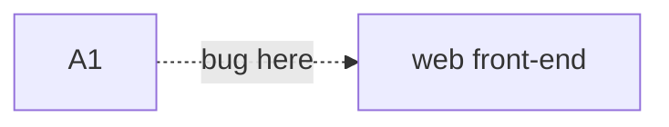
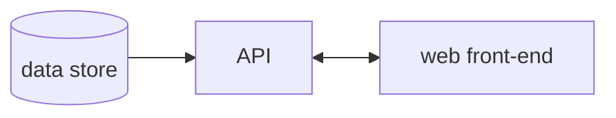

# A01 - Broken Access Control

OWASP Top 10 - A01 2021

Ref: [https://owasp.org/Top10/A01_2021-Broken_Access_Control/](https://owasp.org/Top10/A01_2021-Broken_Access_Control/)


## \# 1 - Broken Access Control

This means "_the user can access something they aren't supposed to_".

The logic for a "broken access control" will primarily take place in the API, 
but the effects of this vulnerability will show up in the interaction between
API and front-end.



## Example Architecture

A simplified model to start with.



## Example Code

This code represents a "protected" route that is still susceptible to broken access control.

This route provides access to a store's product data. 

The route is only open to authenticated users, via the `[Authorize]` attribute, and it's making 
use of a claim model to limit access to all products to only admins and vendors. However, the 
provided claims aren't validated against an approved source, and they are provided as plaintext
from the client-side request. Meaning we have easily spoofed claims which users could take 
advantage of. 

A user with non-admin access could change their claim in a browser's dev tools, and elevate their
permissions to gain access to more than only products that are "for sale".

```csharp
[Authorize]
[HttpPost]
public async Task<ActionResult<IEnumerable<Product>>> GetProducts([FromBody] UserClaims claims)
{
    if (_context.Products == null) return NotFound();

    if (claims.Contains("admin", "vendor")) 
    {
        return await _context.Products.Select(p => p).ToListAsync();
    }

    return await _context.Products.Where(p => p.ForSale == true).ToListAsync();
}
```