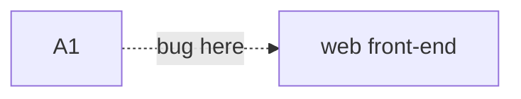
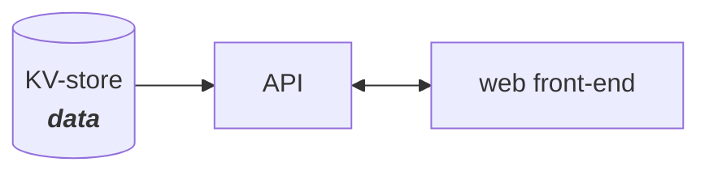

# A01 - Broken Access Control

OWASP Top 10 - A01 2021

Ref: [https://owasp.org/Top10/A01_2021-Broken_Access_Control/](https://owasp.org/Top10/A01_2021-Broken_Access_Control/)

## OWASP \# 1 - Broken Access Control

This means "_the user can access something they aren't supposed to_".

The logic for a "broken access control" will primarily take place in the API, 
but the effects of this vulnerability will show up in the interaction between
API and front-end.

## Example Architecture

A simplified model to start with.

