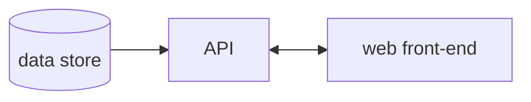

# A02 - Cryptographic Failures

OWASP Top 10 - A02

Failures related to cryptography.

Ref: [https://owasp.org/Top10/A02_2021-Cryptographic_Failures/](https://owasp.org/Top10/A02_2021-Cryptographic_Failures/)

## \# 2 - Cryptographic Failures

*explanation here*

## Example Architecture

A simplified model to start with.

