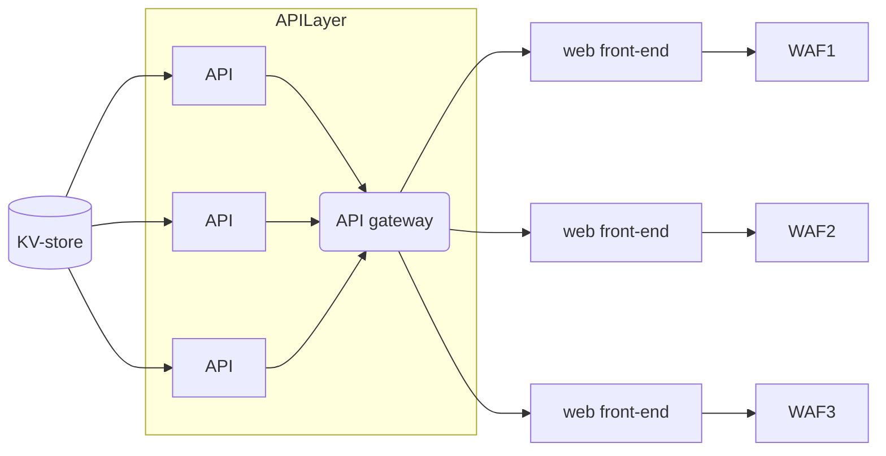

# Application Architecture

This is similar to what the full-fledged deployment would look like.

```mermaid
flowchart LR
    db[(KV-store)] --> B1[API]
    db[(KV-store)] --> B2[API]
    db[(KV-store)] --> B3[API]

    subgraph APILayer
        B1 --> C(API gateway)
        B2 --> C(API gateway)
        B3 --> C(API gateway)
    end

    C --> FE-1[web front-end] --> WAF1
    C --> FE-2[web front-end] --> WAF2
    C --> FE-3[web front-end] --> WAF3   
```