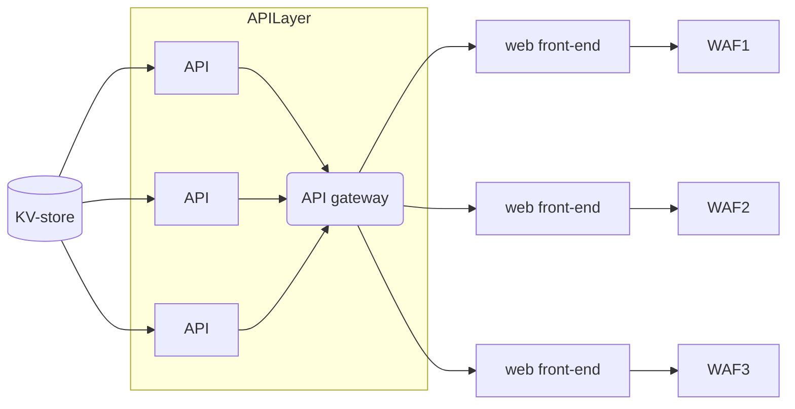
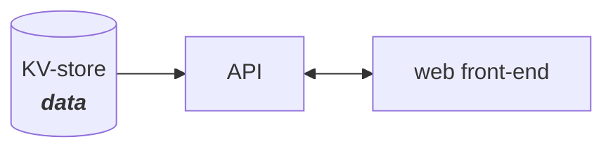
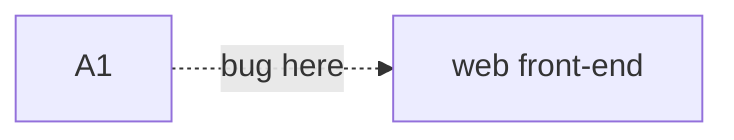

# Application Architecture

This is similar to what the full-fledged deployment would look like.

## Simplified

A simplified model to start with.

## OWASP \# 1 - Broken Access Control

This means "_the user can access something they aren't supposed to_".

The logic for a "broken access control" will primarily take place in the API, 
but the effects of this vulnerability will show up in the interaction between
API and front-end.

Ref: [https://owasp.org/Top10/A01_2021-Broken_Access_Control/](https://owasp.org/Top10/A01_2021-Broken_Access_Control/)